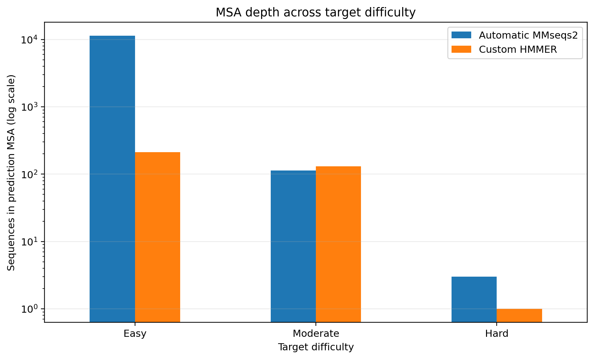
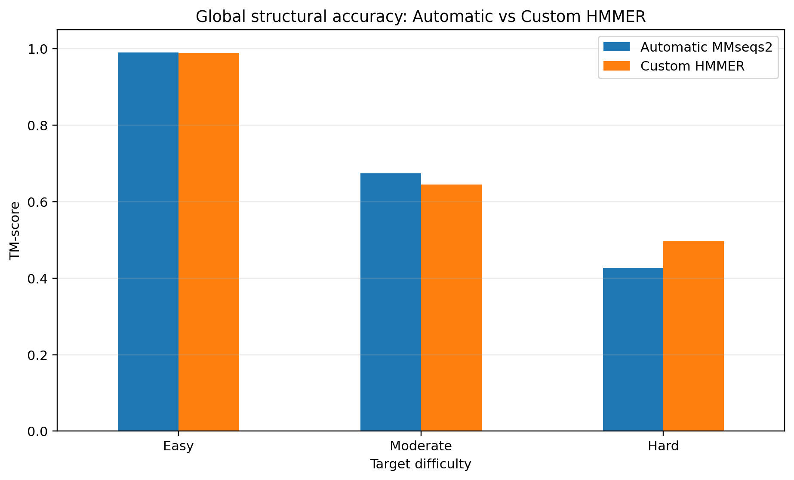
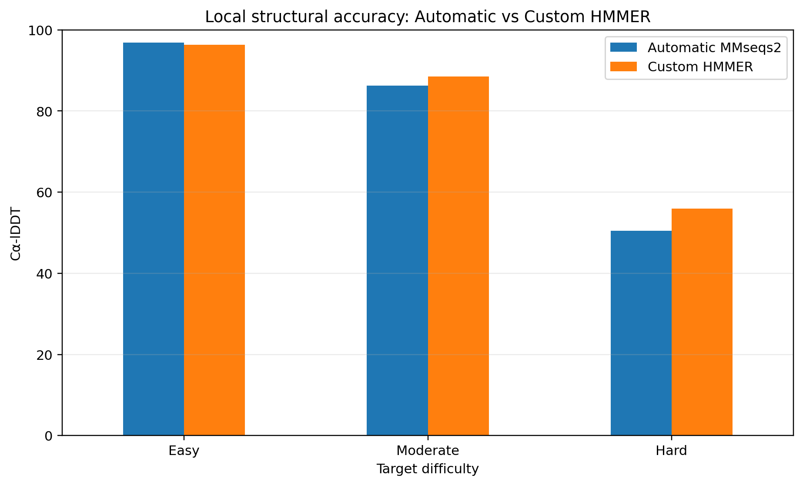
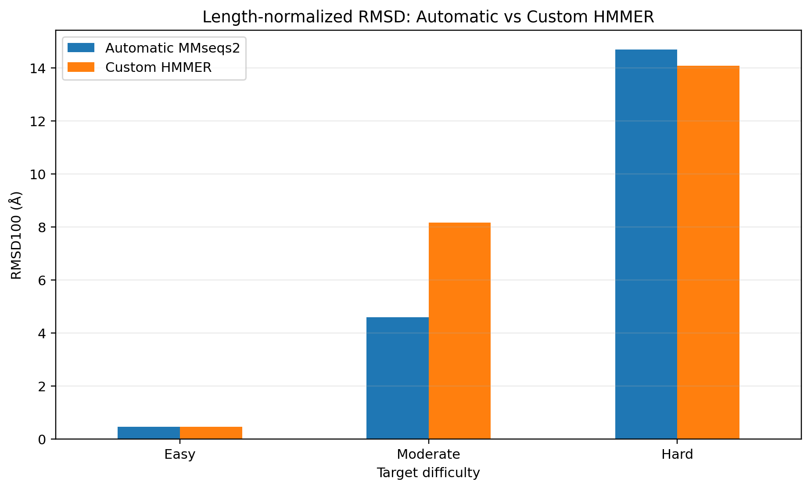

# Effect of MSA Depth and Homolog Availability on AlphaFold2 Structure Prediction

## Project Overview

This project investigates how the availability and composition of homologous sequences in a multiple sequence alignment (MSA) affect AlphaFold2 protein-structure prediction.

Three CASP15 single-chain targets were selected to represent different evolutionary-information regimes:

- **Easy / deep:** T1188
- **Moderate / intermediate:** T1106s1
- **Hard / shallow:** T1122

For each target, predictions generated using the standard **ColabFold MMseqs2 MSA** were compared with predictions generated using a **custom JackHMMER MSA**.

For the Easy target, an additional **DeepMSA2** alignment was evaluated.

## Research Question

**Does the benefit of a custom MSA depend on how much useful evolutionary information is available for the protein family?**

## Experimental Design

| Difficulty | CASP15 Target | PDB | Length | Resolution | Homolog Availability |
|---|---|---|---:|---:|---|
| Easy | T1188 | 8C6Z | 630 aa | 1.85 Å | Deep |
| Moderate | T1106s1 | 7QIH | 122 aa | 1.92 Å | Intermediate |
| Hard | T1122 | 8BBT | 241 aa | 1.69 Å | Very shallow |

### Prediction conditions

**T1188 Easy**
- Automatic MMseqs2
- Custom HMMER
- Custom DeepMSA2

**T1106s1 Moderate**
- Automatic MMseqs2
- Custom HMMER

**T1122 Hard**
- Automatic MMseqs2
- Custom HMMER

All structure predictions were performed with **AlphaFold2 through ColabFold v1.6.3**.

## MSA Depth

| Target | MSA Condition | MSA Depth |
|---|---|---:|
| T1188 Easy | Automatic MMseqs2 | 11,337 |
| T1188 Easy | Custom HMMER | 213 |
| T1188 Easy | Custom DeepMSA2 | 25,136 |
| T1106s1 Moderate | Automatic MMseqs2 | 113 |
| T1106s1 Moderate | Custom HMMER | 130 |
| T1122 Hard | Automatic MMseqs2 | 3 |
| T1122 Hard | Custom HMMER | 1 |



## Structural Accuracy Results

| Target | MSA Condition | pLDDT | pTM | TM-score | Cα-lDDT | Cα RMSD | RMSD100 |
|---|---|---:|---:|---:|---:|---:|---:|
| Easy | Automatic MMseqs2 | 90.66 | 0.885 | 0.990 | 96.88 | 0.87 Å | 0.46 Å |
| Easy | Custom HMMER | 89.72 | 0.878 | 0.990 | 96.28 | 0.88 Å | 0.47 Å |
| Easy | Custom DeepMSA2 | 90.86 | 0.885 | 0.991 | 96.63 | 0.84 Å | 0.45 Å |
| Moderate | Automatic MMseqs2 | 70.69 | 0.413 | 0.674 | 86.28 | 3.82 Å | 4.60 Å |
| Moderate | Custom HMMER | 72.63 | 0.422 | 0.645 | 88.48 | 6.78 Å | 8.18 Å |
| Hard | Automatic MMseqs2 | 45.42 | 0.493 | 0.426 | 50.44 | 20.82 Å | 14.70 Å |
| Hard | Custom HMMER | 45.82 | 0.464 | 0.496 | 55.91 | 19.95 Å | 14.08 Å |







## Main Observations

### Easy — T1188

All three MSA strategies produced highly accurate structures.

Despite large differences in MSA depth:

- Automatic MMseqs2: **11,337 sequences**
- Custom HMMER: **213 sequences**
- DeepMSA2: **25,136 sequences**

their TM-scores were all approximately **0.99**.

This suggests that for this target, sufficient evolutionary information was already available and increasing MSA depth produced little additional structural improvement.

### Moderate — T1106s1

The comparison was metric-dependent.

The Custom HMMER prediction had:

- higher pLDDT
- higher pTM
- higher Cα-lDDT

while the Automatic MMseqs2 prediction had:

- higher TM-score
- substantially lower RMSD and RMSD100

Only **71 of 122 residues** could be mapped to the experimental structure, so this result should be interpreted cautiously.

### Hard — T1122

Both prediction conditions performed poorly compared with the Easy target.

The Custom HMMER condition contained only the query sequence, while the automatic alignment contained three sequences.

Despite having no additional homologs, the Custom HMMER prediction showed:

- higher TM-score
- higher Cα-lDDT
- slightly lower RMSD

than the Automatic prediction.

This result also illustrates that AlphaFold2 confidence scores do not always correspond directly to experimental structural accuracy.

## Overall Interpretation

The results suggest that **MSA depth alone is not sufficient to explain AlphaFold2 prediction quality**.

The usefulness of an alignment also depends on factors such as:

- homolog relevance
- sequence diversity
- sequence coverage
- alignment quality

For the Easy target, a relatively small filtered HMMER alignment performed almost as well as alignments containing thousands of sequences.

For the Hard target, adding a very small number of sequences did not necessarily improve prediction accuracy.

Because only three proteins were examined, these results should be interpreted as a **case study rather than a universal relationship**.

## Repository Structure

```text
.
├── analysis/
│   ├── analysis_summary.md
│   └── casp15_structure_comparison_metrics.csv
├── docs/
│   ├── methods.md
│   └── limitations.md
├── figures/
├── msa/
│   ├── easy_T1188/
│   ├── moderate_T1106s1/
│   └── hard_T1122/
├── notebooks/
├── structures/
│   ├── experimental/
│   └── predicted/
└── targets/
    ├── target_selection.md
    └── target_sequences.fasta
